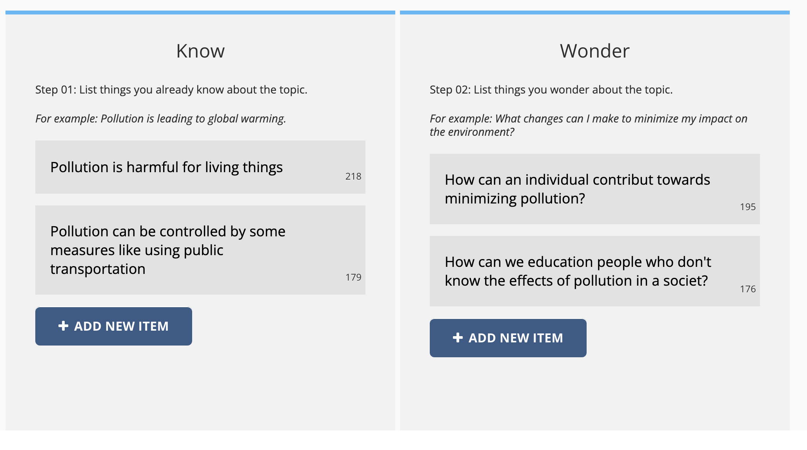
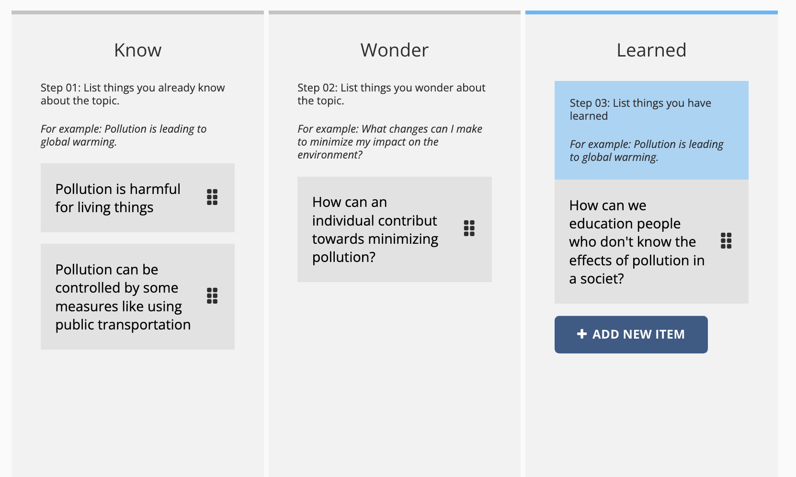

Edly Know Wonder Learn  

---------------------------------------------

This XBlock enables learners to organize their thoughts and expectations before starting a course. Specifically, learners can use this component to identify what they already know about the course content, as well as what they are curious to learn.

Once the course is completed, learners can revisit their initial thoughts and assess what they actually learned. They can then move each point into a third category called `Learned` which showcases the knowledge they gained through the course.

To summarize, the XBlock helps learners to:

1. Identify their prior knowledge and questions about the course content before starting.
2. Reflect on what they learned during and after the course.
3. Categorize their knowledge into `Know`, `Wonder`, and `Learned`

Installation
------------

1. Install the requirements into `lms` and `studio` shell
    
    ```
    pip install -e git@github.com:edly-io/kwl-xblock.git@release-v0.1.0#egg=kwl
    ```
    
2. Got to `lms/envs/common.py` and add `kwl.kwl_djangoapp` in OPTIONAL_APPS
    
    ```python
    OPTIONAL_APPS = (
    	('kwl.kwl_djangoapp', None) # add this only
    )
    ```
    
3. Got to `cms/envs/common.py` and add `kwl.kwl_djangoapp` in OPTIONAL_APPS
    
    ```python
    OPTIONAL_APPS = (
    	('kwl.kwl_djangoapp', None) # add this only
    )
    ```
    
4. Apply migrations in LMS or Studio shells
    
    ```python
    python manage.py lms migrate
    python manage.py cms migrate
    ```

Enabling in Studio
------------------

You can enable Know-Wonder-Learn XBlock in the studio through the advanced settings.

1. From the main page of a specific course, navigate to `Settings -> Advanced Settings` from the top menu.
2. Check for the `advanced_modules` policy key, and add `"kwl"`.
3. Click the `"Save changes"` button.
4. To add this XBlock, select `Know-Wonder-Learn` from the Advance component

### Example

At the start of a course, add `Know-Wonder-Learn` XBlock from Advance components. You can modify headings and examples from the settings of this Xblock.



At the end of a course, add `Know-Wonder-Learn` XBlock again and enable the Learned column from the settings. To show `Learned` columns to the learner check the marker named `Enable learned column`



Running the workbench
---------------------
`python manage.py runserver 8000`

Access it at 

[http://localhost:8000](http://localhost:8000)
